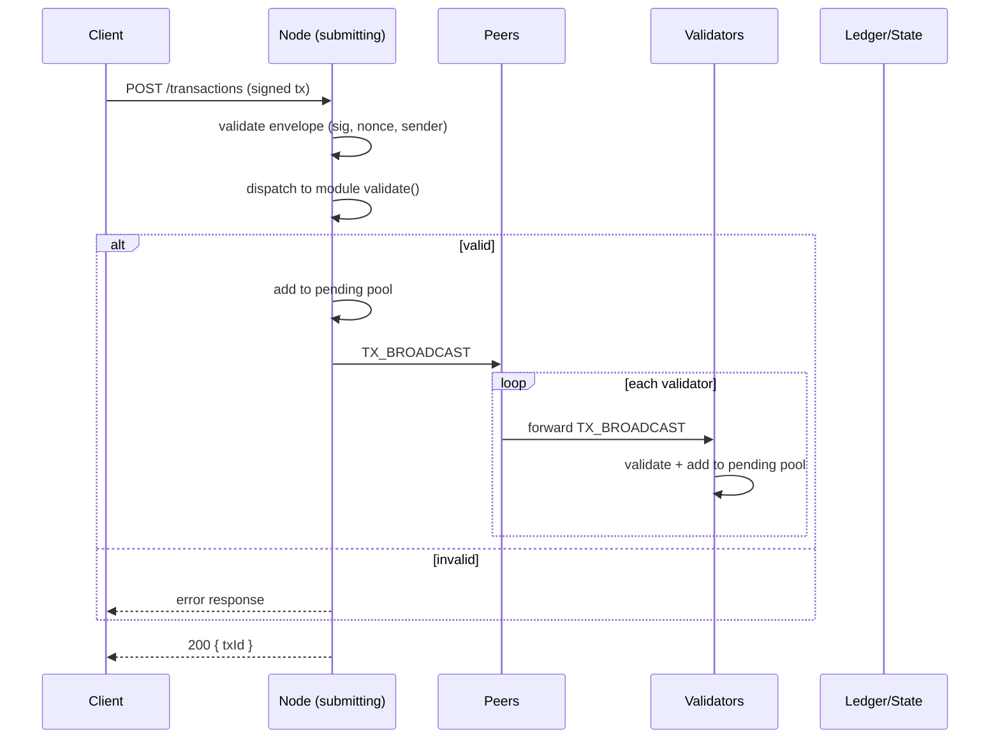
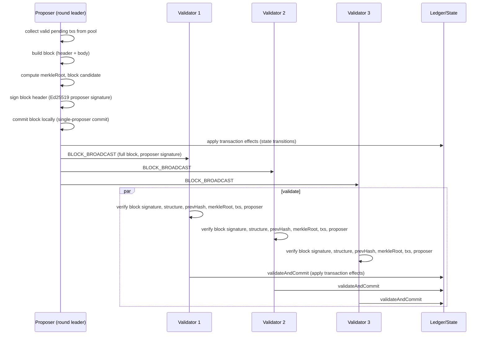

# CTN Blockchain Protocol Specification

## Version

Current protocol version: **1.0**

## Transport

All messages between peers travel over **WebSockets** (`ws` library). Each node runs a WebSocket server on a configurable port and connects to known peers as a WebSocket client.

## Message Types

| Message Type | Direction | Description |
|--------------|-----------|-------------|
| `HANDSHAKE` | Both | Initial authentication: exchange public keys and signed nonces |
| `TX_BROADCAST` | Broadcast | A new signed transaction to propagate to the network |
| `BLOCK_BROADCAST` | Broadcast | A committed block (full body + proposer signature), as it propagates to the network |
| `BLOCK_REQUEST` | Request/Response | Request a block by hash or height (e.g. catch-up) |
| `SYNC_REQUEST` | Request | Request chain history from a given height |
| `SYNC_RESPONSE` | Response | Blocks in response to a sync request |
| `PEER_DISCOVERY` | Both | Gossip known peer addresses |
| `HEARTBEAT` | Both | Periodic ping/pong to keep connections alive |

## Message Envelope

Every message is a single JSON object wrapped in a consistent envelope:

```json
{
  "type": "TX_BROADCAST",
  "version": "1.0",
  "nodeId": "<hex(publicKey)>",
  "timestamp": "2024-01-01T00:00:00.000Z",
  "payload": { "...": "type-specific..." },
  "signature": "<hex(Ed25519 signature)>"
}
```

### Envelope Fields

| Field | Type | Description |
|-------|------|-------------|
| `type` | string | One of the message types above |
| `version` | string | Protocol version (`"1.0"`) |
| `nodeId` | string | Sender's node ID = hex(Ed25519 public key) |
| `timestamp` | string | ISO 8601 timestamp of message creation (UTC) |
| `payload` | object | The type-specific message body |
| `signature` | string | Ed25519 signature over the canonical envelope (all fields except `signature`) |

All messages are JSON over WebSocket. The `signature` authenticates the sender and prevents tampering with the envelope payload.

## Authentication (Handshake)

Every new peer connection must complete an authenticated handshake before any other messages are processed (see [NETWORK_SPEC.md](./NETWORK_SPEC.md#authentication)):

1. **CONNECTING** — TCP/WebSocket connection established.
2. **Authenticate** — both parties exchange `HANDSHAKE` messages containing their node ID and a signature over a session nonce with their Ed25519 key.
3. **Verify** — each party verifies the other's signature against the published public key and checks the node is authorized.
4. **CONNECTED** — once both sides verify, normal message exchange begins.

A peer that fails authentication is disconnected and its credentials are not accepted from the network.

## Transaction Flow

The following sequence diagram shows the full lifecycle of a submitted transaction:



## Block Creation Flow

The following sequence diagram shows PoA block creation and commit:



## Sync Protocol

When a new or lagging peer joins, it must synchronize its ledger (see [NETWORK_SPEC.md](./NETWORK_SPEC.md#synchronization)):

1. The peer connects and authenticates.
2. The peer sends `SYNC_REQUEST` indicating the highest height it has (`fromHeight`, default `0`).
3. A responding peer replies with `SYNC_RESPONSE` containing the ordered blocks from `fromHeight + 1` up to its tip.
4. The requesting peer verifies each block (previous-hash linkage, signatures, merkle roots) and appends them.
5. If more blocks remain, the peer issues further `SYNC_REQUEST`s until caught up.

New peers request the chain starting from the **highest block** they already have (or `0` for a fresh node), so they build the identical canonical chain from genesis.
